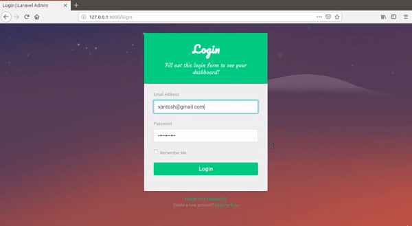
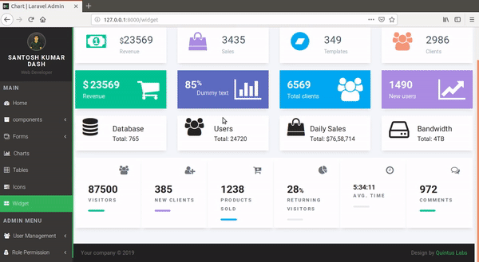
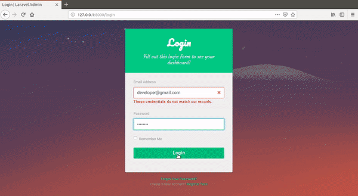

<p align="center"></p>

<p align="center">
<a href="https://travis-ci.org/laravel/framework"></a>
<a href="https://packagist.org/packages/laravel/framework"></a>
<a href="https://packagist.org/packages/laravel/framework"></a>
<a href="https://packagist.org/packages/laravel/framework"></a>
</p>

# A Simple Admin Dashboard with user roles and permissions 

## About this application

Laravel Dashboard with user management and user's Role and Permissionon is one more super versatile site canvas that will take your breath away with the number of features it rocks. With as solid admin that you can build with the out of this world Laravel Dashboard, you are on the right path to see the success you want to see. Having it all in total order is a must when running a business and bringing it to an entirely new level.  With Laravel Dashboard, that is very achievable.  Laravel Dashboard is an admin panel with multiple screen designs and loads of other pages. It also has a full-screen button and a hide and show button for the sidebar. When both options turned on, you are all in your statistics and information, nothing else disturbing you.


##### Framework: Laravel 5.8
##### Language : PHP 7.2

## Install
- Type this line:
```
composer update
```
- To change Database go to "config/database.php" and then change database. Default Database is SQLite.

- Migrate Database by typing this:
```
php artisan migrate
```


rename .env.example to .env

verify db credentials

php artisan key:generate

php artisan config:cache

php artisan serve

# To add admin Role and Permission
   Un Comment these lines in routes/web.php
   ```
   // use Spatie\Permission\Models\Role;
   
  // use Spatie\Permission\Models\Permission; 
  
  // Route::get('/create_role_permission', function(){
  
 //        $role = Role::create(['name'=> 'Administer']);
 
 //        $permission = Permission::create(['name'=> 'Administer roles & permissions']);
 
 //        auth()->user()->assignRole('Administer');
 
 //        auth()->user()->givePermissionTo('Administer roles & permissions');
 
 //    });
 
run server -> login -> after login (http://127.0.0.1:8000/create_role_permission)

```


# Screen








## License

The Laravel framework is open-source software licensed under the [MIT license](https://opensource.org/licenses/MIT).
